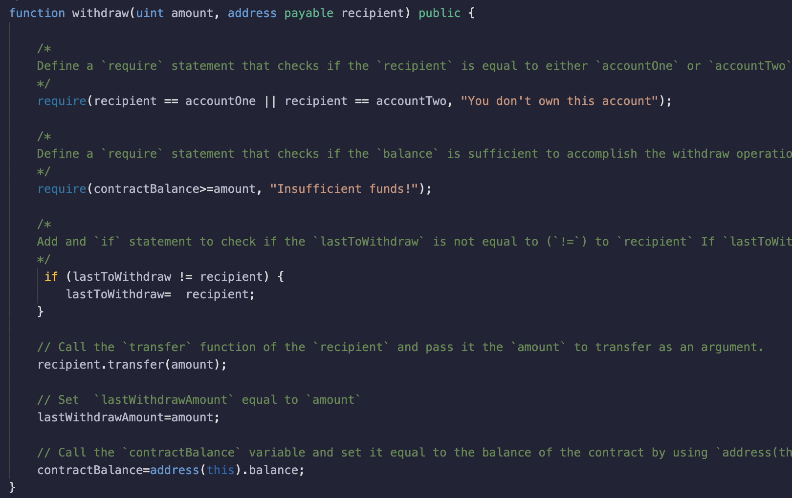
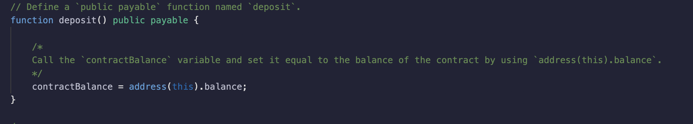
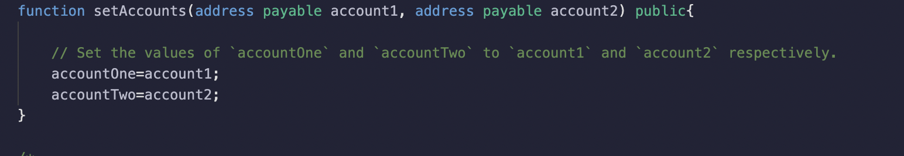
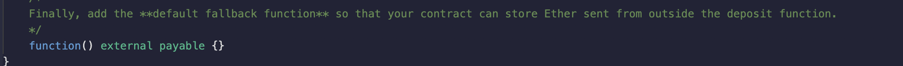
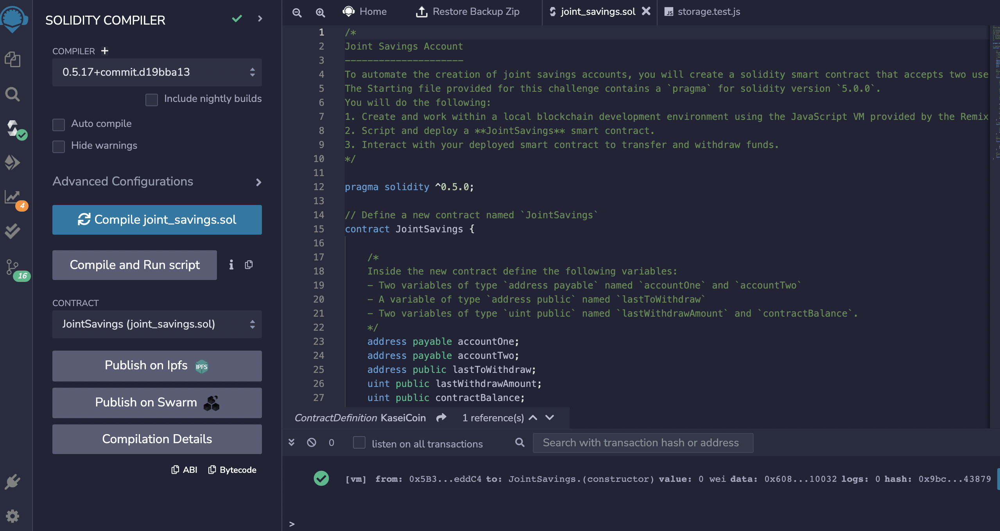
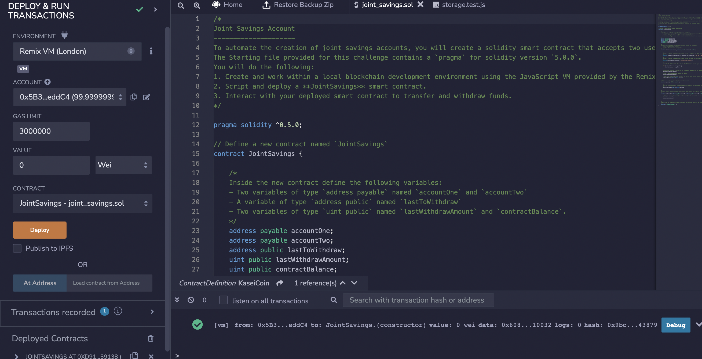

# blockchain_joint_account

## Instructions

The steps for this Challenge are divided into the following sections:

1. Create a Joint Savings Account Contract in Solidity
2. Compile and Deploy Your Contract in the JavaScript VM
3. Interact with Your Deployed Smart Contract

## Technology 

Remix IDE was used to compile and deploy the contract which was coded in solidity 

## Define functions 

1. withdraw 

2. deposit 

3. set accounts

4. external payable 

## Compile and Deploy in Remix IDE 

## Transact